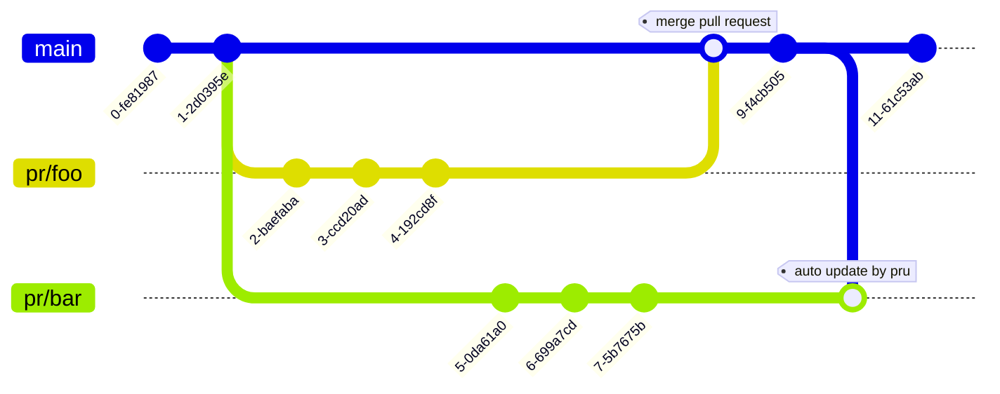

# pru-action

GitHub action for [pru](https://github.com/winebarrel/pru).

pru is a tool that updates pull requests branch from the base branch that contains specified files.



## Usage

```yaml
name: pru
on:
  push:
    branches:
      - main
    paths:
      - "**/*.go"
      - Makefile
permissions:
  contents: write
  pull-requests: write
jobs:
  pru:
    name: pru
    runs-on: ubuntu-latest
    steps:
      - uses: winebarrel/pru-action@v0.3.1
        with:
          # version: v0.3.1
          # repo: owner/nama
          # github-token: ***
          # bases: main,master
          paths: |
            **/*.go
            Makefile
```

## Example

see https://github.com/winebarrel/pru-example
